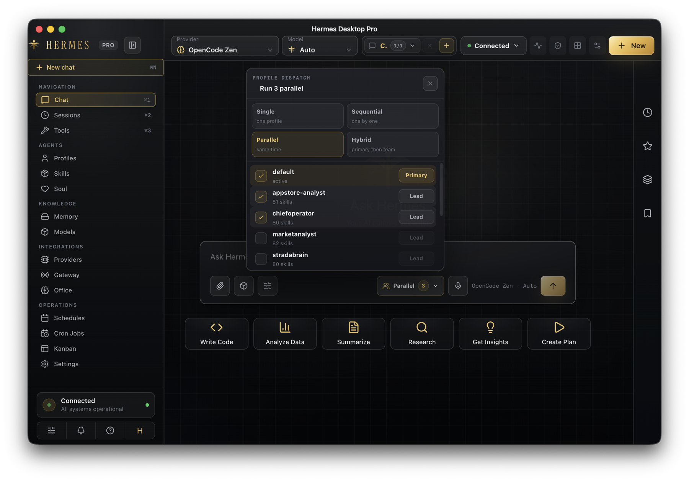
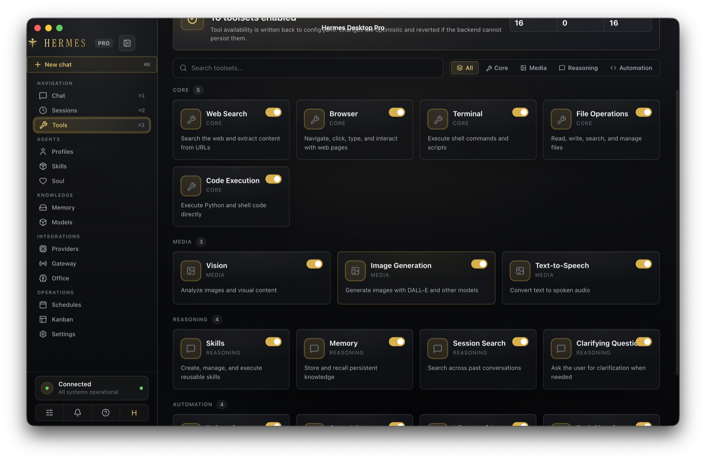
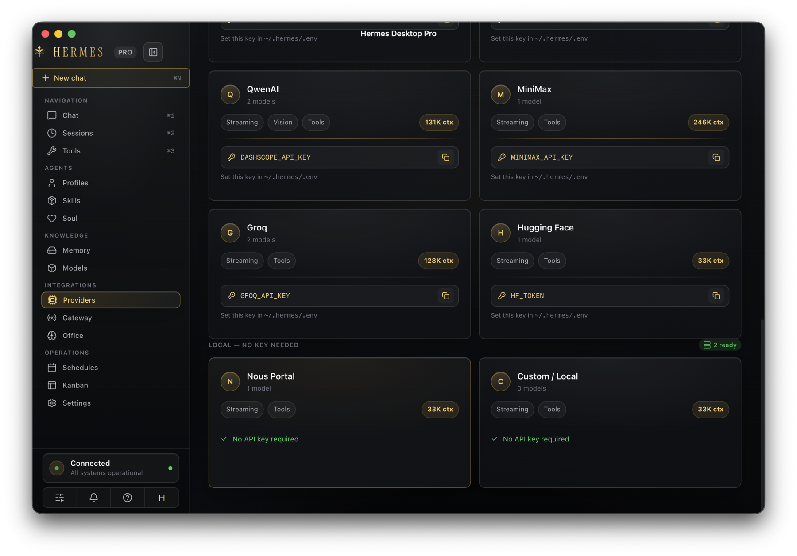
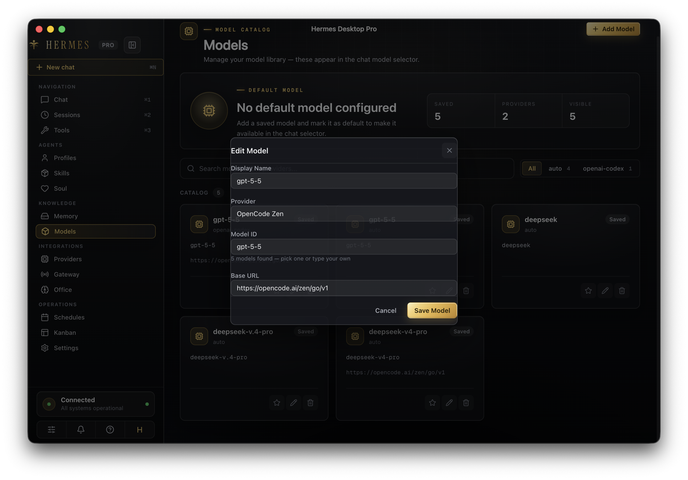

# Hermes Desktop Pro

[English](README.md) · [简体中文](README.zh-CN.md) · [日本語](README.ja.md)

Hermes Desktop Pro는 Hermes agents를 위한 macOS 우선 독립형 데스크톱 command center입니다. 채팅 실행, 다중 프로필 dispatch, 모델/프로바이더 관리, 도구, 스킬, 메모리, 스케줄, cron jobs, 칸반, Hermes Office 공간 워크스페이스를 하나의 프리미엄 데스크톱 앱에 통합합니다.

Hermes Office는 Hermes Desktop Pro 내부에 포함되어 있습니다. 별도 제품 셸이 아니며 Hermes 앱 identity, 내비게이션, 비주얼 시스템을 대체해서는 안 됩니다.



## 제품 개요

Hermes Desktop Pro는 여러 AI 프로필과 워크플로를 하나의 로컬 데스크톱 화면에서 운영하기 위한 앱입니다. 제품 identity는 Electron 및 embedded runtime과 분리되어 있습니다. Electron은 데스크톱 framework일 뿐이며 앱 이름, bundle metadata, Dock/menu identity, 패키지 산출물은 Hermes Desktop Pro로 표시됩니다.

UI는 마케팅 페이지가 아니라 실제 운영 workspace로 설계되었습니다. 다크/골드 Hermes visual system, compact desktop controls, 읽기 쉬운 panels, persistent navigation을 통해 chat, tools, models, providers, memory, schedules, cron jobs, kanban, Office 사이를 context를 잃지 않고 이동할 수 있습니다.

## 제품 화면

### Chat Command Center

Chat page는 핵심 실행 화면입니다. 여러 open chats, close/new controls, provider/model selectors, inspector panels, quick actions, 구조화된 profile dispatch picker를 지원합니다.


### Tools Matrix

Tools와 plugins는 capability별로 그룹화되며 UI에서 toggle할 수 있고 agent configuration flow에 반영됩니다.



### Provider Catalog

Providers 화면은 model counts, capability tags, context windows, API-key requirements, local/no-key provider status를 보여줍니다.



### Model Dialogs

Model 생성과 편집은 dimmed app background, 명확한 fields, action-focused controls를 갖춘 centered modal dialogs에서 이루어집니다.



## 핵심 기능

- Tab switching, close controls, new chat creation, active-session loading을 갖춘 multi-chat workspace.
- Chat composer에서 실행되는 real multi-profile execution: single, sequential, parallel, hybrid dispatch modes.
- 하나의 prompt를 하나의 profile, 여러 profiles, 또는 primary profile plus team으로 보낼 수 있는 profile-scoped commands.
- Prompt intake, context preparation, generation, tool activity, usage, completion, abort, error states를 보여주는 agent run timeline.
- Activity, context, pinned information, model state, tool controls, memory를 위한 inspector panels.
- Local environment key handling을 포함한 provider/model catalog management.
- Grouped capability filters와 enable/disable controls를 갖춘 tools and plugin matrix.
- Profiles, skills, persona/soul, persistent memory, schedules, cron jobs, kanban operations.
- 같은 Hermes application shell 안에 embedded 된 Hermes Office spatial command floor.

## 실행 모델

Hermes Desktop Pro는 multi-profile execution을 mock으로 처리하지 않습니다. Renderer는 preload bridge를 통해 Electron main process로 dispatch request를 보내고, main process는 선택된 profiles를 real chat execution path로 실행한 뒤 status를 UI로 stream합니다.

지원되는 dispatch modes:

- `single`: 선택한 하나의 profile에 prompt 전송.
- `sequential`: 선택한 profiles를 순차 실행.
- `parallel`: 선택한 profiles를 동시에 실행.
- `hybrid`: primary profile을 먼저 실행한 뒤 selected team에 dispatch.

UI는 profile별 state를 유지하므로 사용자는 queued, running, completed, aborted, failed runs를 정적 mockup이 아니라 실제 상태로 확인할 수 있습니다.

## 앱 섹션

- `Chat`: direct prompts, agent runs, tool activity, multi-profile dispatch를 위한 command center.
- `Sessions`: session browsing과 active-chat loading.
- `Profiles`: 각자 config, models, skills, memory, gateway state를 가진 isolated Hermes workspaces.
- `Tools`: toolset availability, grouped filters, enable/disable controls.
- `Skills`: agents가 사용할 수 있는 reusable capabilities and workflows.
- `Soul` / `Persona`: agent의 behavior, tone, principles.
- `Memory`: sessions를 넘어 Hermes가 recall할 수 있는 persistent context.
- `Models`: saved model catalog와 default model selection.
- `Providers`: provider catalog, API-key hints, context windows, local providers.
- `Gateway`: local communication and integration server controls.
- `Office`: embedded Hermes Office spatial command floor.
- `Schedules`: recurring scheduled work.
- `Cron Jobs`: profile-scoped cron registry, active/paused state, edit controls, profile grouping.
- `Kanban`: durable multi-agent task board.
- `Settings`: connection mode, network, providers, appearance, backup, diagnostics, runtime preferences.

## 아키텍처

Hermes Desktop Pro는 Electron, React, TypeScript, Vite, Tailwind CSS, SQLite-backed local state를 사용합니다.

- `src/main`: Electron main process, IPC handlers, local runtime orchestration, app windows, packaged identity, backend-facing execution.
- `src/preload`: renderer surfaces와 main-process APIs 사이의 안전한 bridge.
- `src/renderer`: React interface, visual system, chat workspace, pages, dialogs, timeline, inspector, Office container.
- `src/shared`: shared types, provider metadata, i18n helpers, URL helpers, cross-process contracts.
- `resources`: app icons와 package resources.
- `build`: macOS entitlements와 packaging support files.

앱은 user-facing identity를 framework identity와 분리합니다. `package.json`은 `productName: "Hermes Desktop Pro"`를 사용하고 package metadata는 `com.hermes.desktop-pro`, app icon은 Hermes asset set에서 가져옵니다.

## 요구 사항

- 패키징된 macOS build는 macOS 11 이상 필요.
- Node.js 22 이상 권장.
- npm.
- Live chat과 agent workflows를 위한 Hermes/OpenCode runtime access.

## 개발

의존성 설치:

```bash
npm install
```

개발 모드로 desktop app 실행:

```bash
npm run dev
```

일반 검증 스위트 실행:

```bash
npm run lint
npm run typecheck
npm test
npm run build
```

## macOS 앱으로 열기

소스에서 실행할 때 가장 빠른 no-AI 경로:

```bash
npm install
npm run start:mac
```

`start:mac`은 실제 로컬 application bundle을 build한 뒤 macOS로 엽니다. Apple Silicon에서는 `dist/mac-arm64/Hermes Desktop Pro.app`, Intel에서는 `dist/mac/Hermes Desktop Pro.app`에 생성됩니다.

`.app` bundle만 build하고 열지 않으려면:

```bash
npm run build:mac:app
```

macOS가 로컬 unsigned build를 차단하면 `Hermes Desktop Pro.app`을 우클릭하고 한 번 `열기`를 선택하세요. 공개 배포용 DMG는 Developer ID certificate와 notarization으로 서명해야 합니다.

## 패키징

배포 가능한 macOS DMG 및 ZIP artifacts build:

```bash
npm run build:mac
```

Apple Silicon만 build:

```bash
npm run build:mac:arm64
```

Intel만 build:

```bash
npm run build:mac:x64
```

다른 platform scripts는 `npm run build:linux`, `npm run build:win`, `npm run build:all`로 사용할 수 있습니다.

## Office

Hermes Office는 Office page 내부에서 start/stop합니다. Office view는 Hermes Desktop Pro에 embedded 되며 main Hermes navigation과 app chrome을 유지해야 합니다.

Office가 멈춘 것처럼 보이면 먼저 Office controls에서 local Office runtime logs를 확인하고, 같은 page에서 Office runtime을 다시 시작하세요.

## 릴리스 체크리스트

출시 전:

1. `npm run typecheck` 실행.
2. `npm run lint` 실행.
3. `npm test` 실행.
4. `npm run build` 실행.
5. 대상 platform package.
6. Packaged app을 열고 chat tabs, multi-profile dispatch, Activity inspector, model/provider dialogs, cron jobs, Office startup을 수동 확인.

## 키워드

Hermes Desktop Pro, AI desktop app, agent workspace, multi-agent execution, OpenCode desktop, Electron React app, macOS AI app, local AI command center, provider management, AI workflow automation, cron jobs, kanban, agent memory.
